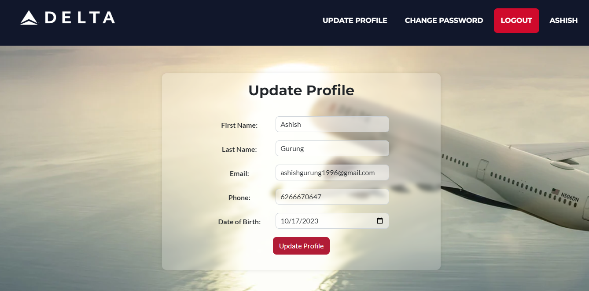
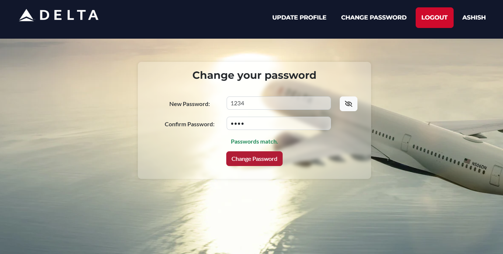

# J2EE Profile Project

This J2EE project is designed for user registration, login, profile management, and password updates. It uses MySQL as the backend database to securely store and retrieve user data. Users can register, log in, update their profile details, and change their passwords, providing a comprehensive web application for managing user accounts.

# User Registration

    

        
    

    

        <h2>Registration Form</h2>       
        
This project includes a user registration form to allow new users to create accounts. The registration form typically collects the following information:
        
        - First Name
        - Last Name
        - Email address
        - Password
        - Phone Number
        - Date of Birth

Users can fill in the required information and submit the form to create an account. 
The registration form includes validation checks to ensure data integrity and security.

# User Login

    

        
    

    

        <h2>Login Form</h2>

This project includes a user login form for registered users to access their accounts. The login form requires the following information:

        - Email address
        - Password

Users can log in by providing their registered email and password. If the user does not have an account, they can create one by clicking the "Create an Account" link.

### Create an Account

If you don't have an account yet, you can click on the "create an account" link to access the features of this application.

# User Profile Update

    

        
    

    

        <h2>Update Profile</h2>

 Users can update their profile details, apart from the password. The following information can typically be updated:

        - First Name
        - Last Name
        - Email address
        - Phone Number
        - Date of Birth
        - Additional details as per your application's requirements

To update your profile, log in to your account and navigate to the profile management section. Make the necessary changes to your profile and save the updates.

# User Change Password

    

        
    

    

        <h2>Change Password</h2>

Users can change their password to enhance security. To change your password, follow these steps:

        1. Log in to your account.
        2. Navigate to the change password section.
        3. Enter your new password.
        4. Confirm your new password by re-entering it.
        5. Click the "Change Password" button.

Ensure that your new password and the confirmed password match before clicking the "Change Password" button. Passwords are typically case-sensitive.

Changing your password regularly helps to keep your account secure.

